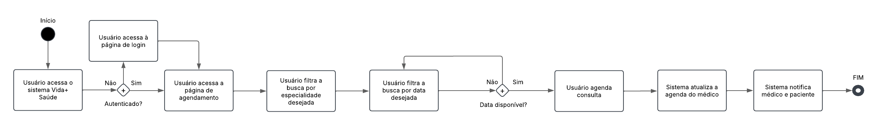
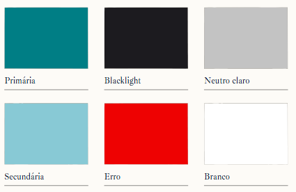
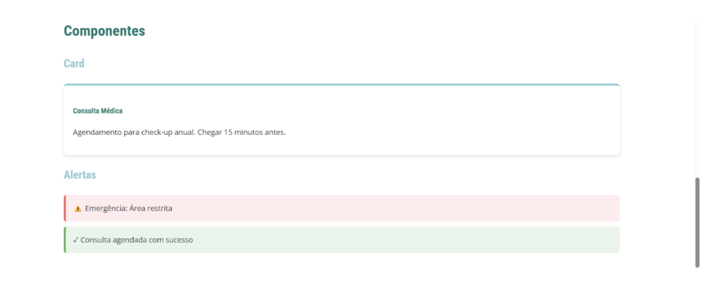
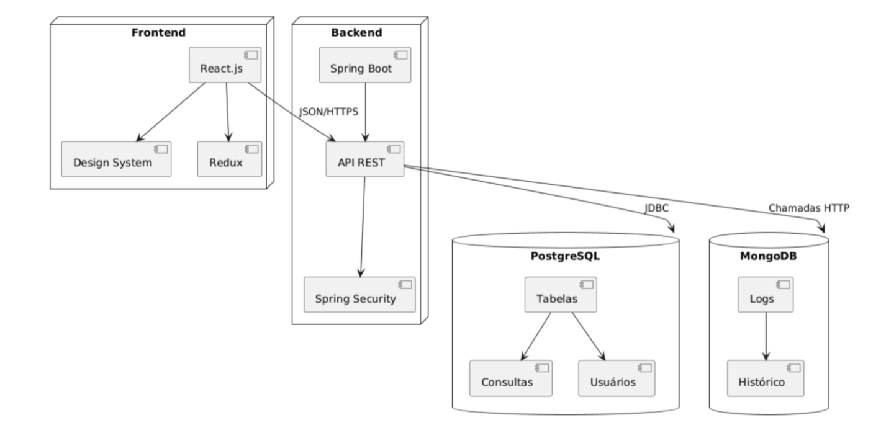

# Sistema de Gestão de Consultas Médicas  
**Documentação Técnica Completa**  

**Grupo de Arquitetura de Software**  
**Professora**: Angélica Guimarães  
**Curso**: Engenharia de Software – PUC Minas  

---

## 1. Contexto do Sistema

### 1.1 Objetivos

Modernizar o sistema de gestão da clínica Vida+ Saúde substituindo processos manuais por:

- Agendamento online por pacientes  
- Visualização em tempo real da agenda por médicos  
- Dashboard administrativo com métricas de atendimento  

### 1.2 Requisitos Arquiteturais

| Requisito        | Solução Adotada           | Justificativa                           |
|------------------|---------------------------|-----------------------------------------|
| Escalabilidade   | Microserviços             | Preparado para expansão futura          |
| Segurança        | Spring Security + JWT     | Autenticação robusta                    |
| Responsividade   | Design System + Tailwind  | Adaptação a dispositivos móveis         |
| Manutenibilidade | React + Storybook         | Componentização e documentação clara    |

---

## 2. Fluxos de Processo

### 2.1 Fluxograma de Agendamento



---

## 3. Design System Detalhado

### 3.1 Fundamentos Visuais

#### Paleta de Cores



#### Tipografia

- **Títulos**: Roboto Condensed (700)  
  - Tamanhos: 2.5rem (h1), 2rem (h2)  
- **Corpo do Texto**: Open Sans (400)  
  - Base: 1rem  
  - Legendas: 0.875rem
  
  


#### Explicação da Seleção de Cores

A paleta de cores escolhida para o sistema de gestão de consultas médicas foi cuidadosamente selecionada para transmitir confiança, tranquilidade e profissionalismo, características essenciais em um ambiente de saúde.

##### 1. Primária (#007968 - Verde Água Escuro)

- **Significado**: Transmite tranquilidade, harmonia e confiança  
- **Uso**: Botões primários, cabeçalhos e elementos de destaque  
- **Justificativa**: Verde é associado à saúde e bem-estar

##### 2. Secundária (#88C9D5 - Azul Claro)

- **Significado**: Limpeza e profissionalismo  
- **Uso**: Botões secundários e elementos interativos  
- **Justificativa**: Complementa o verde mantendo a acessibilidade

##### 3. Apoio (#FF5252 - Vermelho)

- **Significado**: Alerta e urgência  
- **Uso**: Mensagens de erro, alertas de emergência  
- **Justificativa**: Segue convenções de UX para destaque imediato

##### 4. Neutra (#E0E0E0 - Cinza Claro)

- **Significado**: Neutralidade e organização  
- **Uso**: Fundos, bordas e estados desabilitados  
- **Justificativa**: Melhora a legibilidade e reduz fadiga visual

#### Estados dos Botões

| Estado       | Cor       |
|--------------|-----------|
| Normal       | #88C9D5   |
| Hover        | #00796B   |
| Desabilitado | #E0E0E0   |

#### Exemplo de Botão

```jsx
<Button  
  variant="primary"  
  size="lg" 
  aria-label="Confirmar agendamento" 
  onClick={handleAgendamento}
>
  Confirmar Consulta
</Button>
```
  
  
  
  
---

### Tokens de Espaçamento

| Token        | Valor | Uso                            |
|--------------|-------|---------------------------------|
| --space-xs   | 4px   | Espaçamentos internos pequenos |
| --space-md   | 16px  | Padding padrão                 |
| --space-lg   | 24px  | Margens entre seções           |

---

## 4. Arquitetura do Sistema

### 4.1 Diagrama de 3 Camadas



#### Explicação do Diagrama

O sistema segue uma arquitetura em 3 camadas (Frontend, Backend, Banco de Dados), com padrões complementares para escalabilidade e manutenção.

#### 1. Frontend (React.js)

- **Tecnologias**:  
  - React: Componentes reutilizáveis  
  - Redux: Gerenciamento de estado global  
  - Tailwind CSS + Storybook: Responsividade e documentação  

- **Ligações Internas**:  
  - Componentes consomem dados via API REST  
  - Redux sincroniza estados entre telas

#### 2. Backend (Spring Boot)

- **Tecnologias**:  
  - Spring Security + JWT  
  - API REST  
  - PostgreSQL (JDBC) para dados estruturados  
  - MongoDB para logs (não estruturados)

- **Padrões**:  
  - Repository  
  - Strategy (ex: cancelamento com 24h)

#### 3. Banco de Dados

- **PostgreSQL**:  
  - Dados relacionais (consultas, usuários, especialidades)  
  - Transações ACID

- **MongoDB**:  
  - Logs e histórico de consultas (CQRS)

#### Ligações entre Camadas

- **Frontend ↔ Backend**:  
  - Chamadas HTTP com JWT

- **Backend ↔ Banco de Dados**:  
  - JDBC para PostgreSQL  
  - Drivers nativos para MongoDB

---

### Decisões Críticas (ADRs)

#### ADR-001: Escolha do Spring Boot

- **Contexto**: Regras complexas (ex: cancelamento com 24h)  
- **Alternativas**: Node.js (Express), Python (Django)  
- **Consequências**: Integração simples com JPA e Spring Security

#### ADR-002: Uso de MongoDB para Logs

- **Contexto**: Armazenamento de dados não estruturados  
- **Padrão**: CQRS (Command Query Responsibility Segregation)

---

### 4.2 Decisões Arquiteturais

| Camada        | Tecnologia             | Benefícios                               |
|---------------|------------------------|-------------------------------------------|
| Apresentação  | React                  | Componentes reutilizáveis, estado global  |
| Negócio       | Spring Boot (Java)     | Suporte a regras complexas                |
| Dados         | PostgreSQL + MongoDB   | ACID + flexibilidade para logs            |

---

### 4.3 Estilos e Padrões Arquiteturais

#### Estilo Principal: Arquitetura em Camadas (3-Tier)

- Separação de responsabilidades  
- Facilita manutenção e escalabilidade vertical

#### Padrões Complementares

| Padrão     | Aplicação                | Benefício                               |
|------------|---------------------------|------------------------------------------|
| MVC        | Frontend (React)          | Separação de View e Controller           |
| Repository | Backend (Spring Boot)     | Isolamento do acesso a dados             |
| Strategy   | Backend (validações)      | Flexibilidade para mudanças              |

---

### 4.4 Qualidades Arquiteturais Atendidas

| Atributo       | Garantido por                                     |
|----------------|---------------------------------------------------|
| Escalabilidade | Microserviços preparados para expansão            |
| Segurança      | JWT + Spring Security + RBAC                      |
| Desempenho     | Cache para consultas frequentes                   |
| Testabilidade  | Componentes React isolados e documentados         |

---

## 5. Modelagem de Dados Avançada

### 5.1 DER Completo


---

## 6. Plano de Testes

### 6.1 Matriz de Testes

| Tipo        | Ferramenta | Cobertura                            |
|-------------|------------|---------------------------------------|
| Unitário    | Jest       | 85%+ dos componentes React            |
| Integração  | Postman    | 100% dos endpoints da API             |
| UI          | Cypress    | Telas críticas e principais fluxos    |
