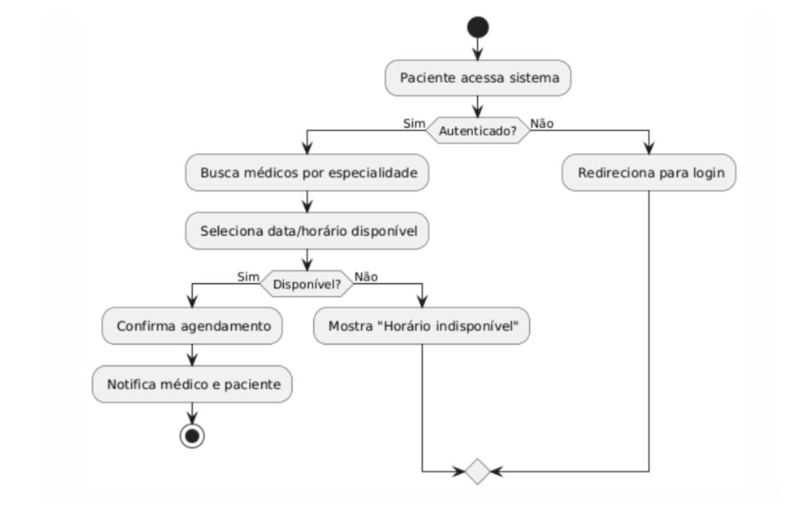
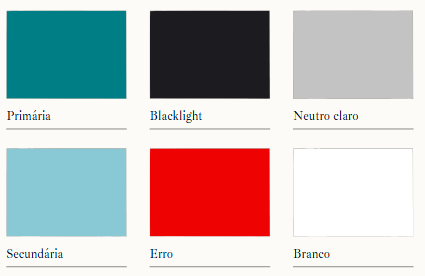
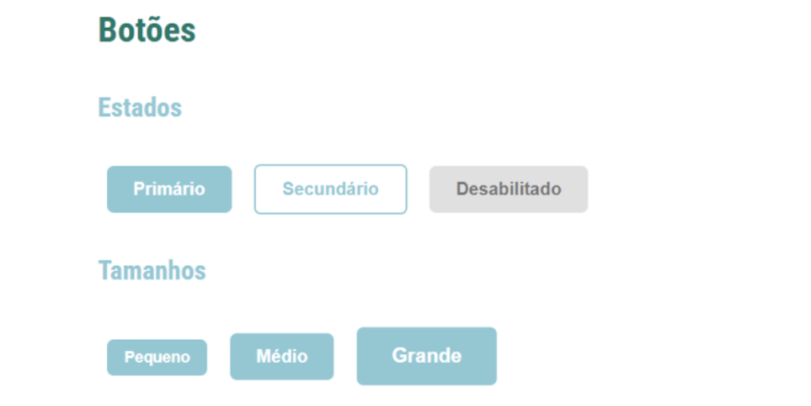
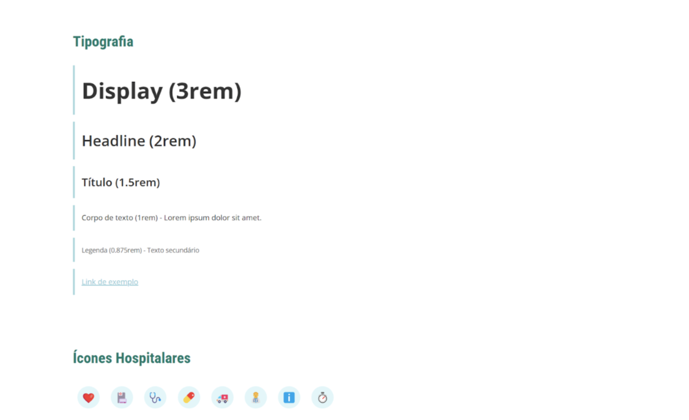
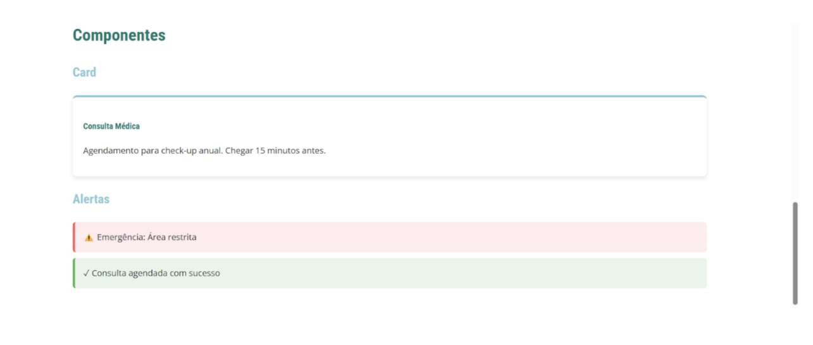
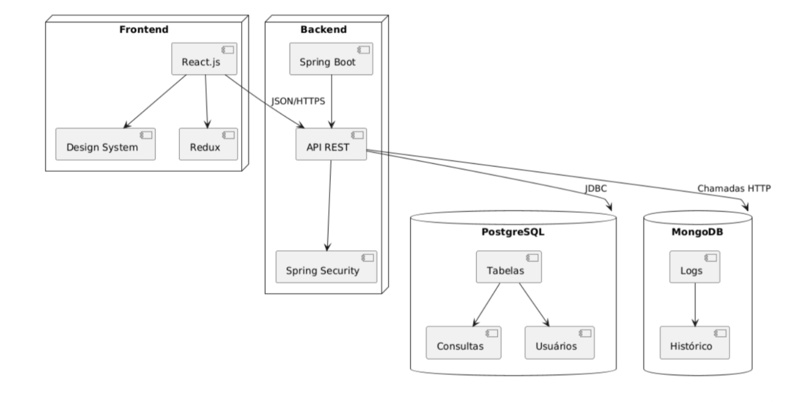
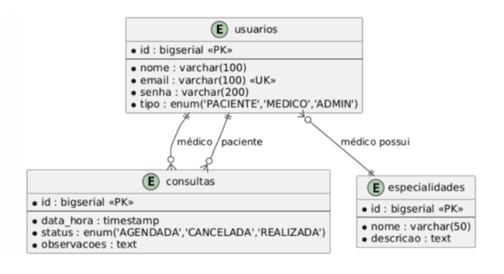

# Sistema de Gestão de Consultas Médicas  
**Documentação Técnica Completa**  

**Grupo de Arquitetura de Software**  
**Professora**: Angélica Guimarães  
**Curso**: Engenharia de Software – PUC Minas  

---

## 1. Contexto do Sistema

### 1.1 Design System 
Abordando *design system* em um contexto arquitetural, é um sistema estruturado reutilizável que conecta design, desenvolvimento e experiência do usuário de forma coesa e escalável, definindo um conjunto de regras, padrões, componentes e diretrizes que orientam de ponta a ponta do sistema.

Portanto, para o sistema Vida+ Saúde, foram selecionados componentes arquiteturais condizentes com os requisitos do sistema em termos de escalabilidade, adaptabilidade, acessibilidade e agilidade. A seguir, são explicados os componentes e sua implicação no contexto do sistema.

### 1.2 Objetivos

Modernizar o sistema de gestão da clínica Vida+ Saúde substituindo processos manuais por:

- Agendamento online por pacientes  
- Visualização em tempo real da agenda por médicos  
- Dashboard administrativo com métricas de atendimento  

### 1.2 Requisitos Arquiteturais

| Requisito        | Solução Adotada           | Justificativa                           |
|------------------|---------------------------|-----------------------------------------|
| Escalabilidade   | Microsserviços            | Preparado para expansão futura da clínica para novas unidades e especialidades |
| Segurança        | Spring Security + JWT     | Proteção de dados sensíveis de saúde (LGPD) e prontuários médicos |
| Responsividade   | MUI + Tailwind            | Adaptação a dispositivos móveis para agendamentos rápidos por pacientes e visualização por médicos em trânsito |
| Manutenibilidade | React                     | Facilidade para adicionar novas especialidades médicas e tipos de consulta |

---

## 2. Fluxos de Processo

### 2.1 Fluxograma de Agendamento


---

## 3. Design System Detalhado

### 3.1 Fundamentos Visuais

#### Paleta de Cores



#### Tipografia

- **Títulos**: Poppins (700)  
- **Corpo do Texto**: Poppins SemiBold (400)  
- **Auxiliar**: Poppins Regular

#### Explicação da Seleção de Cores

A paleta de cores escolhida para o sistema de gestão de consultas médicas foi selecionada para transmitir confiança, tranquilidade e profissionalismo, características essenciais em um ambiente de saúde.

##### 1. Primária (#007968 - Verde Água Escuro)

- **Significado**: Transmite tranquilidade, harmonia e confiança  
- **Uso**: Botões primários, cabeçalhos e elementos de destaque  
- **Justificativa no contexto médico**: O Verde Água é associado à saúde e bem-estar, transmitindo segurança aos pacientes durante o processo de agendamento, especialmente importante para reduzir a ansiedade em consultas de primeira vez ou exames preventivos

##### 2. Secundária (#88C9D5 - Azul Claro)

- **Significado**: Limpeza e profissionalismo  
- **Uso**: Botões secundários e elementos interativos  
- **Justificativa no contexto médico**: Complementa o verde mantendo a acessibilidade e reforça a sensação de ambiente clínico profissional, essencial para conquistar a confiança do paciente em relação à qualidade do atendimento médico

##### 3. Apoio (#FF5252 - Vermelho)

- **Significado**: Alerta e urgência  
- **Uso**: Mensagens de erro, alertas de emergência, sinalizadores de consultas urgentes  
- **Justificativa no contexto médico**: Essencial para destacar horários de emergência, consultas com preparação especial (jejum, documentos necessários) e alertas de cancelamento com menos de 24 horas, ajudando a prevenir não-comparecimentos

##### 4. Neutra (#E0E0E0 - Cinza Claro)

- **Significado**: Neutralidade e organização  
- **Uso**: Fundos, bordas e estados desabilitados  
- **Justificativa no contexto médico**: Melhora a legibilidade de informações críticas como histórico de consultas e resultados de exames, além de reduzir fadiga visual para médicos que usam o sistema por longos períodos durante plantões

#### Estados dos Botões

| Estado       | Cor       | Contexto de uso em sistema médico |
|--------------|-----------|-----------------------------------|
| Normal       | #88C9D5   | Estado padrão para ações como "Agendar consulta" |
| Hover        | #00796B   | Feedback visual ao selecionar horários disponíveis |
| Desabilitado | #E0E0E0   | Horários já ocupados ou especialidades não disponíveis |

#### Exemplo de Botão

```jsx
<Button  
  variant="primary"  
  size="lg" 
  aria-label="Confirmar agendamento" 
  onClick={handleAgendamento}
>
  Confirmar Consulta
</Button>
```
  
  
  
  
---

### Tokens de Espaçamento

| Token        | Valor | Uso no contexto médico                          |
|--------------|-------|------------------------------------------------|
| --space-xs   | 4px   | Espaçamentos internos em campos de formulário de agendamento, garantindo densidade informacional sem sobrecarregar o paciente |
| --space-md   | 16px  | Padding padrão em cards de médicos e especialidades, facilitando a leitura de informações críticas como especialidade e tempo de consulta |
| --space-lg   | 24px  | Margens entre seções de histórico médico e agendamento futuro, criando separação visual clara para evitar confusão de datas |

**Justificativa para estes valores específicos**: A hierarquia de espaçamento (4px, 16px, 24px) garante a legibilidade adequada para pacientes idosos (que são uma parcela significativa dos usuários) enquanto mantém a densidade informacional necessária para médicos e administradores visualizarem múltiplas consultas em uma única tela.

---

## 4. Arquitetura do Sistema

### 4.1 Diagrama de 3 Camadas



#### Explicação do Diagrama

O sistema segue uma arquitetura em 3 camadas (Frontend, Backend, Banco de Dados), com padrões complementares para escalabilidade e manutenção.

#### 1. Frontend (React.js)

- **Tecnologias**:  
  - React + MUI: Componentes responsivos reutilizáveis como calendários, seletores de horário e cards de médicos  
  - Redux: Gerenciamento de estado global para manter consistência entre agendamentos simultâneos  
  - Figma: Documentação  

- **Justificativa no contexto médico**:
  - A escolha do Tailwind CSS permite adaptação rápida a diferentes dispositivos, essencial para pacientes que precisam agendar consultas com urgência pelo celular
  - A componentização em React facilita a adição de novas especialidades e tipos de consulta (presencial/telemedicina) sem reescrever o sistema
  - O Figma documenta os componentes e telas permitindo que novos desenvolvedores mantenham a consistência visual nas futuras expansões da clínica

- **Ligações Internas**:  
  - Componentes consomem dados via API REST  
  - Redux sincroniza estados entre telas para evitar agendamentos duplicados

#### 2. Backend (Spring Boot)

- **Tecnologias**:  
  - Spring Security + JWT: Autenticação com níveis de acesso separados (paciente, médico, administrador)  
  - API REST: Endpoints específicos por perfil com validações contextuais  
  - PostgreSQL (JDBC) para dados estruturados como agendamentos e prontuários  
  - MongoDB para logs de acesso e histórico completo de consultas

- **Padrões**:  
  - Repository: Abstração do acesso a dados sensíveis de pacientes
  - Strategy: Implementa regras específicas como:
    - Cancelamento com 24h de antecedência
    - Priorização de consultas de emergência
    - Reagendamento automático em caso de imprevisto médico
    - Notificações diferenciadas por tipo de consulta

- **Justificativa no contexto médico**:
  - O padrão Strategy permite implementar políticas específicas para diferentes especialidades (ex: cardiologia pode exigir 48h para cancelamento, enquanto clínica geral apenas 24h)
  - A robustez do Spring Boot facilita o cumprimento de requisitos regulatórios de saúde e LGPD

#### 3. Banco de Dados

- **PostgreSQL**:  
  - Dados relacionais (consultas, usuários, especialidades)  
  - Transações ACID para garantir que agendamentos e prontuários nunca fiquem em estado inconsistente

- **MongoDB**:  
  - Logs e histórico completo de consultas (CQRS)
  - Armazenamento flexível para observações médicas de formato variável

- **Justificativa no contexto médico**:
  - MongoDB permite armazenar anotações médicas e históricos de consulta em formato livre, adaptando-se às diferentes necessidades documentais de cada especialidade
  - A combinação com PostgreSQL garante integridade nos dados críticos como agendamentos e dados pessoais

#### Ligações entre Camadas

- **Frontend ↔ Backend**:  
  - Chamadas HTTP com JWT para proteção de dados médicos sensíveis

- **Backend ↔ Banco de Dados**:  
  - JDBC para PostgreSQL  
  - Drivers nativos para MongoDB

#### Arquitetura de Microserviços Detalhada

A escolha por microserviços baseia-se na necessidade de flexibilidade, escalabilidade e manutenção independente de cada aspecto do sistema médico. Nossa arquitetura é composta pelos seguintes microserviços:

1. **Serviço de Agendamento**:
   - **Responsabilidades**: Gestão de calendários, validação de disponibilidade, confirmação de consultas
   - **Tecnologias específicas**: Spring Scheduler, Cache Redis para horários mais buscados
   - **Escalabilidade**: Escalado horizontalmente em períodos de campanha de saúde

2. **Serviço de Prontuário**:
   - **Responsabilidades**: Armazenamento e recuperação de histórico médico, anexos e exames
   - **Tecnologias específicas**: Armazenamento criptografado, políticas rigorosas de acesso
   - **Conformidade**: Implementação específica para LGPD e CFM (Conselho Federal de Medicina)

3. **Serviço de Notificações**:
   - **Responsabilidades**: Envio de lembretes, confirmações e reagendamentos
   - **Tecnologias específicas**: Apache Kafka para filas de mensagens, templates personalizados por especialidade
   - **Canais**: Email, SMS e WhatsApp conforme preferência do paciente

4. **Serviço de Faturamento**:
   - **Responsabilidades**: Integração com convênios, geração de recibos, controle de pagamentos
   - **Tecnologias específicas**: Integração com gateways de pagamento e sistemas de convênios médicos
   - **Automações**: Geração de guias TISS para reembolso de convênios

5. **API Gateway**:
   - **Responsabilidades**: Roteamento, autenticação centralizada, rate limiting
   - **Tecnologias específicas**: Spring Cloud Gateway, Resilience4j para circuit breaking
   - **Segurança**: Centralização de políticas de JWT e controle de acesso por perfil

Esta abordagem permite que cada serviço evolua independentemente - por exemplo, podemos atualizar regras de faturamento sem afetar o sistema de agendamento, ou escalar apenas o serviço de notificações durante campanhas de vacinação.

---

### Decisões Críticas (ADRs)

#### ADR-001: Escolha do Spring Boot

- **Contexto**: Regras complexas de negócio específicas para cada especialidade médica
- **Alternativas**: Node.js (Express), Python (Django)  
- **Consequências**: Integração simples com JPA e Spring Security
- **Relevância para sistema médico**: Permite implementar regras como tempo mínimo entre consultas do mesmo paciente, bloqueio de horários para preparação de consultórios e validações de conflito entre especialidades que compartilham equipamentos

#### ADR-002: Uso de MongoDB para Logs e Histórico Médico

- **Contexto**: Armazenamento de dados não estruturados como anotações médicas  
- **Padrão**: CQRS (Command Query Responsibility Segregation)
- **Relevância para sistema médico**: Diferentes especialidades têm requisitos variados de documentação - dermatologistas podem incluir imagens, psiquiatras podem ter anotações extensas em formato livre, e ortopedistas podem ter medidas específicas. O MongoDB permite esta flexibilidade mantendo a consistência nos dados estruturados de agendamento.

#### Aplicação do Padrão CQRS no Sistema Médico

O padrão CQRS (Command Query Responsibility Segregation) foi implementado para separar as operações de escrita (commands) das operações de leitura (queries), otimizando cada uma para seus casos de uso específicos:

**1. Modelo de Command (Escrita)**
- **Banco de dados**: PostgreSQL para transações ACID
- **Casos de uso**:
  - Agendamento de novas consultas
  - Cancelamentos e reagendamentos
  - Atualizações em cadastros de pacientes
  - Registros de procedimentos médicos realizados
- **Benefícios no contexto médico**: Garante integridade transacional para ações críticas como não permitir dois agendamentos no mesmo horário

**2. Modelo de Query (Leitura)**
- **Banco de dados**: MongoDB para consultas flexíveis e rápidas
- **Casos de uso**:
  - Visualização de histórico médico completo do paciente
  - Dashboard administrativo com métricas e tendências
  - Relatórios gerenciais por especialidade, período ou médico
  - Visualização de agenda diária/semanal para médicos
- **Benefícios no contexto médico**: Permite consultas complexas como "histórico de todos os atendimentos com determinado sintoma" sem impactar o desempenho do sistema transacional

**3. Sincronização entre Modelos**
- **Mecanismo**: Apache Kafka para propagação de eventos
- **Estratégia de consistência**: Eventual consistency com prioridade para disponibilidade
- **Processo**:
  1. Agendamento registrado no PostgreSQL (model de comando)
  2. Evento "Consulta Agendada" publicado no Kafka
  3. Serviço de leitura consome evento e atualiza MongoDB
  4. Todos os dashboards e visualizações refletem o novo agendamento

**4. Exemplo prático no sistema**:
Quando um paciente agenda uma consulta dermatológica:
- O PostgreSQL registra data, hora, paciente, médico e tipo de consulta
- O MongoDB armazena essas informações junto com o histórico de consultas anteriores, permitindo que o médico veja rapidamente a evolução do tratamento
- Após a consulta, o médico registra observações e anexa fotos, que são armazenadas no MongoDB para fácil recuperação futura, enquanto o fato da consulta ter ocorrido é registrado no PostgreSQL para fins de faturamento

Esta abordagem CQRS proporciona o melhor dos dois mundos: integridade transacional para dados críticos e flexibilidade para consultas complexas e análise de dados médicos.

---

### 4.2 Decisões Arquiteturais

| Camada        | Tecnologia             | Benefícios no contexto médico                 |
|---------------|------------------------|-----------------------------------------------|
| Apresentação  | React                  | Componentes especializados para cada tipo de consulta e especialidade  |
| Negócio       | Spring Boot (Java)     | Suporte a regras complexas de agendamento e prontuário eletrônico |
| Dados         | PostgreSQL + MongoDB   | Combinação ideal para dados estruturados de agendamento e observações médicas em formato livre |

---

### 4.3 Estilos e Padrões Arquiteturais

#### Estilo Principal: Arquitetura em Camadas (3-Tier)

- Separação de responsabilidades  
- Facilita manutenção e escalabilidade vertical

#### Padrões Complementares

| Padrão     | Aplicação no contexto médico       | Benefício específico                     |
|------------|-----------------------------------|------------------------------------------|
| MVC        | Frontend (React)                  | Separação entre dados médicos e sua representação, permitindo múltiplas visualizações (paciente, médico, administração) |
| Repository | Backend (Spring Boot)             | Isolamento do acesso a dados sensíveis de saúde, facilitando auditorias de privacidade |
| Strategy   | Políticas de agendamento por especialidade | Flexibilidade para configurar regras específicas para cada departamento médico |

---

### 4.4 Qualidades Arquiteturais Atendidas

| Atributo       | Garantido por                                     | Relevância para sistema médico |
|----------------|---------------------------------------------------|--------------------------------|
| Escalabilidade | Microserviços preparados para expansão            | Suporta crescimento da clínica com novas especialidades e unidades |
| Segurança      | JWT + Spring Security + RBAC                      | Proteção de dados sensíveis de pacientes conforme LGPD |
| Desempenho     | Cache para consultas frequentes                   | Resposta rápida em momentos críticos de alta demanda (epidemias, campanhas) |
| Testabilidade  | Componentes React isolados e documentados         | Facilita validação de fluxos críticos como agendamento de emergência |

---

## 5. Modelagem de Dados Avançada

### 5.1 DER Completo



---

## 6. Plano de Testes

### 6.1 Matriz de Testes

| Tipo        | Ferramenta | Cobertura                            | Cenários específicos do contexto médico |
|-------------|------------|---------------------------------------|-----------------------------------------|
| Unitário    | Jest       | 85%+ dos componentes React            | Validação de conflitos de agendamento, verificação de disponibilidade médica |
| Integração  | Postman    | 100% dos endpoints da API             | Fluxos completos de agendamento, cancelamento e notificação |
| UI          | Cypress    | Telas críticas e principais fluxos    | Testes de acessibilidade para pacientes idosos, simulação de agendamentos de emergência |